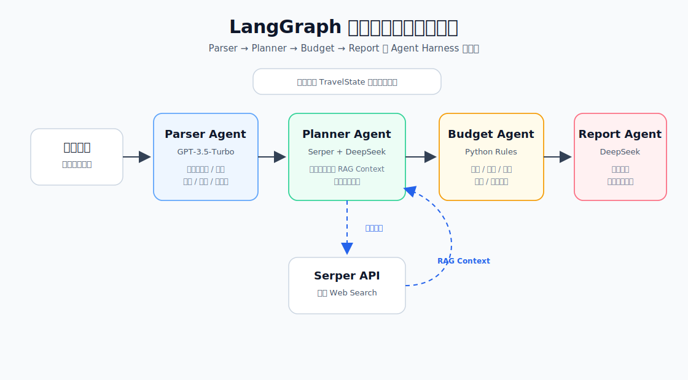
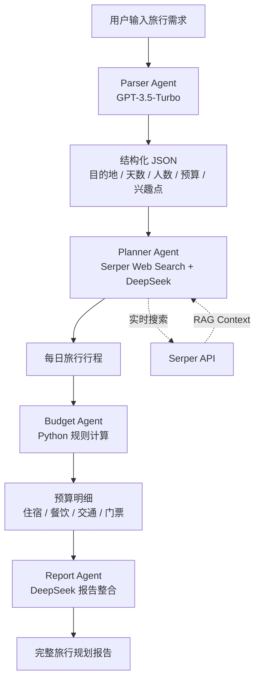

# LangGraph 多智能体旅行规划系统

这是一个基于 **LangGraph** 的 Agent Demo 项目，用来演示如何把一次旅行规划任务拆解成多个智能体节点协同完成，而不是让单个大模型一次性直接回答。

系统整体类似一个轻量级 **Agent Harness / Workflow**：用户输入旅行需求后，工作流会依次经过 **Parser Agent、Planner Agent、Budget Agent、Report Agent** 四个节点，完成需求解析、实时检索、行程生成、预算估算和最终报告整合。

## 项目亮点

- **多 Agent 分工协作**：把复杂任务拆成解析、规划、预算、报告四个职责清晰的节点。
- **LangGraph 工作流编排**：使用 `StateGraph` 管理 Agent 节点之间的状态流转。
- **结构化信息抽取**：Parser Agent 使用 GPT-3.5-Turbo 从自然语言中抽取目的地、天数、人数、预算等级、兴趣点等 JSON 数据。
- **实时 Web Search + RAG Context**：Planner Agent 调用 Serper API 获取最新旅行信息，再把搜索结果作为上下文交给 DeepSeek 生成每日行程。
- **规则化预算计算**：Budget Agent 使用 Python 规则逻辑估算住宿、餐饮、交通、门票等费用。
- **报告生成与润色**：Report Agent 将解析信息、每日行程和预算明细整合成完整中文旅行报告。

## 工作流示意图



## 核心 Agent 说明

### 1. Parser Agent

负责理解用户的自然语言旅行需求，并抽取结构化参数。

示例输入：

```text
我想去上海玩 3 天，2 个人，预算中等，喜欢迪士尼和城市夜景
```

示例解析结果：

```json
{
  "destination": "上海",
  "days": 3,
  "people": 2,
  "budget_level": "中等",
  "travel_style": "朋友游",
  "interests": ["迪士尼", "城市夜景"],
  "special_requirements": []
}
```

### 2. Planner Agent

负责根据 Parser Agent 输出的参数进行旅行规划。

主要步骤：

1. 根据目的地、兴趣点和旅行天数构造搜索 Query。
2. 调用 Serper API 获取实时 Web Search 结果。
3. 将搜索结果作为 RAG Context。
4. 调用 DeepSeek 生成按天拆分的行程安排。

输出内容通常包含：

- 第几天
- 上午景点
- 下午景点
- 晚上活动
- 当天简要描述
- 数据来源标记

### 3. Budget Agent

负责使用 Python 规则逻辑估算旅行预算。

预算维度包括：

- 住宿
- 餐饮
- 交通
- 门票
- 购物
- 应急费用

预算等级一般分为：

- 经济
- 中等
- 豪华

### 4. Report Agent

负责把前面所有 Agent 的结果整合成最终旅行报告。

报告通常包含：

- 旅行基本信息
- 每日详细行程
- 预算明细
- 人均费用
- 出行建议
- 注意事项

## 项目结构

```text
my-agent-system/
├── travel_agent_system.py        # 多智能体旅行规划主程序
├── simple_demo.py                # 最小 LangGraph 示例
├── real_three_agents.py          # 三 Agent 数据查询示例
├── diagnose.py                   # 环境诊断脚本
├── test_imports.py               # 依赖导入测试
├── fix_env.py                    # 环境修复辅助脚本
├── travel_plan.txt               # 示例输出报告
├── travel_plan_with_search.txt   # 带搜索上下文的示例输出
├── travel_plan_hybrid.txt        # 混合模式示例输出
├── search_context.txt            # 搜索上下文示例
└── README.md
```

## 环境准备

建议使用 Python 3.10 或更高版本。

安装依赖：

```bash
pip install langgraph langchain langchain-openai langchain-community openai requests sqlalchemy
```

配置 API Key：

```powershell
$env:OPENAI_API_KEY="your-openai-api-key"
$env:SERPER_API_KEY="your-serper-api-key"
$env:DEEPSEEK_API_KEY="your-deepseek-api-key"
```

如果使用 macOS / Linux：

```bash
export OPENAI_API_KEY="your-openai-api-key"
export SERPER_API_KEY="your-serper-api-key"
export DEEPSEEK_API_KEY="your-deepseek-api-key"
```

> 注意：不要把真实 API Key 提交到代码仓库。建议统一从环境变量读取密钥。

## 运行方式

进入项目目录：

```bash
cd my-agent-system
```

运行旅行规划主程序：

```bash
python travel_agent_system.py
```

根据提示输入旅行需求，例如：

```text
我想去北京玩 4 天，2 个人，预算中等，喜欢历史文化和美食
```

程序会依次执行：

```text
用户需求
  -> Parser Agent 解析结构化信息
  -> Planner Agent 搜索并生成行程
  -> Budget Agent 估算预算
  -> Report Agent 生成最终报告
```

最终会在终端输出完整旅行报告，并保存为文本文件。

## 示例输出

```text
目的地：北京
天数：4 天
人数：2 人
预算等级：中等

Day 1:
上午：天安门广场
下午：故宫博物院
晚上：王府井步行街

Day 2:
上午：八达岭长城
下午：奥林匹克公园
晚上：鸟巢、水立方夜景

预算明细：
住宿：1600 元
餐饮：1200 元
交通：400 元
门票：800 元
总计：约 4000 元
人均：约 2000 元
```

## 技术栈

- Python
- LangGraph
- LangChain
- OpenAI GPT-3.5-Turbo
- DeepSeek Chat
- Serper API
- Python TypedDict / JSON

## 适用场景

这个项目适合作为以下内容的 Demo：

- 多智能体系统课程展示
- LangGraph 工作流案例
- Agent Harness 原型
- RAG + Web Search 旅行规划示例
- LLM 应用拆解与工程化实践

## 后续可扩展方向

- 增加 Streamlit / Gradio 前端页面
- 将预算规则改为可配置表格
- 增加酒店、机票、天气等外部 API
- 支持多轮修改行程
- 增加 LangSmith Trace 观察每个 Agent 节点
- 将 Agent 状态持久化到数据库
